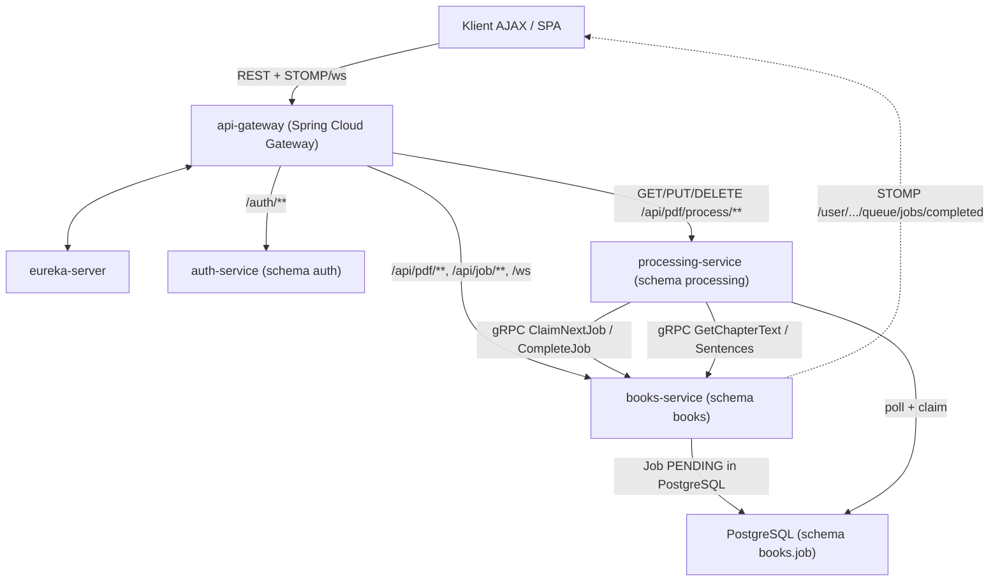

## Microservices Refactor Plan

### Target architecture



### Service mapping from the current monolith
- `auth/*` -> auth-service
- `book_management/*`, `chat/*`, `queue/*` -> books-service (client facade, **Job queue w PostgreSQL**, WebSocket, gRPC server)
- `processing/*` (summary, ideas extraction/explanation) + chat LLM generation -> processing-service (gRPC client, **DB queue poller**)
- `core/config/*` -> split: web/cors/spa/json into books-service; LLM model config (`GeminiCliChatModel`, `MockChatModel`, `MockLLMResponseConfig`) into processing-service.

### Kolejka zadań oparta na bazie danych (zamiast RabbitMQ)

Monolit już trzyma kolejkę w tabeli `Job` ([Job.java](src/main/java/com/orio/book_processing/queue/models/Job.java)) ze statusami `PENDING → COMPLETED | FAILED`. W architekturze mikroserwisowej **źródłem prawdy pozostaje tabela `job` w schemacie `books`** — processing-service nie ma własnej kolejki, tylko **pobiera i finalizuje** zadania przez gRPC.

**Cykl życia zadania LLM:**
1. Klient: `POST /api/pdf/process/...` → books-service zapisuje `Job` (`PENDING`, `payload` JSON) i zwraca `202` + `jobId`.
2. processing-service: `@Scheduled` poller wywołuje gRPC `ClaimNextJob` → books-service atomowo wybiera najstarsze `PENDING` z typem LLM (`FOR UPDATE SKIP LOCKED`), ustawia status `IN_PROGRESS` (nowy status) i zwraca `jobId`, `type`, `payload`, `userId`.
3. processing-service: wykonuje handler (jak dziś `JobHandler`), zapisuje wynik w schemacie `processing`.
4. processing-service: gRPC `CompleteJob(jobId, status, resultId, errorText)` → books-service ustawia `COMPLETED`/`FAILED`, zapisuje `resultId` i wysyła STOMP (`/user/{uid}/queue/jobs/completed`).
5. Klient: po powiadomieniu WebSocket pobiera wynik przez HAL link `result` lub `GET /api/job/{id}`.

**Zadania lokalne (PDF_UPLOAD):** obsługiwane wyłącznie w books-service — `@Async` worker lub `@Scheduled` poller na tabeli `job` z filtrem `type = PDF_UPLOAD`, bez udziału processing-service.

**Zalety vs RabbitMQ (w tym projekcie):**
- Naturalne rozszerzenie istniejącego modelu `Job` + `JobRepository`.
- Brak dodatkowej infrastruktury w docker-compose.
- Spełnia wymaganie **współdziałania asynchronicznego** (REST → kolejka DB → przetwarzanie → WebSocket).
- Wymagane techniki: **gRPC** (tekst rozdziału + kolejka) + **WebSocket/STOMP** (powiadomienia) — bez RabbitMQ.

### Key seams to cut (current code)
- Job dispatch: [JobDispatcher.java](src/main/java/com/orio/book_processing/queue/services/JobDispatcher.java) — usunąć `ApplicationEventPublisher` / `JobCreationEvent`; po `save(PENDING)` zadanie czeka w DB (dla LLM — claim przez processing-service; dla `PDF_UPLOAD` — lokalny worker).
- Job worker: [JobWorkerService.java](src/main/java/com/orio/book_processing/queue/services/JobWorkerService.java) — rozdzielić:
  - **books-service:** `PdfUploadJobHandler` + lokalny poller/worker; gRPC `ClaimNextJob` / `CompleteJob`; STOMP po `CompleteJob`.
  - **processing-service:** `@Scheduled` poller → gRPC `ClaimNextJob` → handlery LLM → gRPC `CompleteJob`.
- Notification: [JobQueueController.java](src/main/java/com/orio/book_processing/queue/controllers/JobQueueController.java) — `@EventListener` zastąpić wywołaniem z handlera `CompleteJob` (bez Spring events między serwisami).
- Chapter text: [ChapterSummaryWorkflow.java](src/main/java/com/orio/book_processing/processing/chapter/summary/ChapterSummaryWorkflow.java) — `chapterService.getChapterEagerly(...)` → gRPC `GetChapterText` / `GetChapterSentences`.
- Encje processing: `@ManyToOne User`/`Chapter`/`Sentence` → kolumny `userId`, `chapterId`, `sentenceId`. `ChatResponse` zostaje w books-service.

### gRPC contract (shared-proto module)
```proto
service BooksService {
  // Dane rozdziału (dla LLM)
  rpc GetChapterText(ChapterRequest) returns (ChapterTextResponse);
  rpc GetChapterSentences(ChapterRequest) returns (stream Sentence);
  rpc GetSentencesByIds(SentenceIdsRequest) returns (stream Sentence);

  // Kolejka zadań (PostgreSQL)
  rpc ClaimNextJob(ClaimJobRequest) returns (ClaimJobResponse);  // empty = brak zadań
  rpc CompleteJob(CompleteJobRequest) returns (CompleteJobResponse);
}
```
`ClaimJobRequest` — opcjonalna lista `JobType` (processing-service podaje tylko typy LLM). `ChapterRequest` — `chapterId` + `userId`.

Implementacja `ClaimNextJob` w books-service (JPA/native):
```sql
SELECT * FROM books.job
WHERE status = 'PENDING' AND type IN (:types)
ORDER BY created_at
FOR UPDATE SKIP LOCKED
LIMIT 1
```
Po claim: `status = IN_PROGRESS`. `CompleteJob` ustawia `COMPLETED`/`FAILED` + `resultId` / `errorText`.

### Gateway routing (method-aware — bez zmian URL po stronie klienta)
- `/auth/**` -> auth-service
- `/api/pdf/chat/**`, `/api/job/**`, `/ws` -> books-service
- `POST /api/pdf/process/**` -> books-service (enqueue = zapis `Job`)
- `GET|PUT|DELETE /api/pdf/process/**` -> processing-service (odczyt/edycja wyników)
- pozostałe `/api/pdf/**` -> books-service

### HATEOAS / HAL
`spring-hateoas` w books-service. `Job`: `self`; `cancel` gdy `PENDING`/`IN_PROGRESS`; `result` gdy `COMPLETED`; `retry` gdy `FAILED`. `Chapter`: warunkowe `summary` / `generate-summary`, `ideas` / `extract-ideas`.

### Config / infra notes (pragmatic)
- `ddl-auto=update`; jedna instancja PostgreSQL, osobne schematy: `auth`, `books`, `processing`.
- Wspólny sekret JWT; processing-service nie weryfikuje JWT — `userId` pochodzi z rekordu `Job` zwróconego przez `ClaimNextJob`.
- Eureka + Gateway (`lb://`).
- docker-compose: **postgres, eureka, gateway, 3 mikroserwisy** — bez RabbitMQ.

### Tabela wymagań (po zmianie)
| Wymaganie | Realizacja |
|---|---|
| REST | books-service, auth-service, processing-service (odczyt wyników) |
| Klient AJAX | SPA → gateway |
| Kontenery + Spring Cloud | Eureka + Gateway + Docker Compose |
| Co najmniej 2 z {gRPC, W3C WS, RabbitMQ} | **gRPC** (rozdział + kolejka) + **WebSocket/STOMP** |
| Współdziałanie asynchroniczne | REST → `Job` w DB → polling/claim → przetwarzanie → `CompleteJob` → WebSocket |
| HATEOAS / HAL | Job, Chapter |

### Recommended implementation order
1. **Multi-module Maven** — parent pom, moduły, przeniesienie kodu do books-service; build działa.
2. **Eureka + Gateway + docker-compose** (postgres, bez RabbitMQ) — monolit za gatewayem.
3. **auth-service** — wydzielenie, test register/login.
4. **books-service jako klient Eureka** — checkpoint auth + books.
5. **Kolejka DB w books-service** — usunięcie Spring events; lokalny worker dla `PDF_UPLOAD`; status `IN_PROGRESS` przy claim (na razie claim lokalny, przygotowanie pod gRPC).
6. **gRPC server w books-service** — rozdział + `ClaimNextJob` / `CompleteJob`.
7. **processing-service** — przeniesienie logiki LLM, poller `@Scheduled`, gRPC claim/complete + odczyt rozdziałów; schemat `processing`.
8. **HAL** — reprezentacje Job i Chapter.
9. **Dockerize + dokumentacja** — pełny `docker-compose up`, aktualizacja [Lisak Maciej Projekt Mikroserwisy.md](Lisak%20Maciej%20Projekt%20Mikroserwisy.md) (sekcja RabbitMQ → kolejka PostgreSQL + gRPC).
